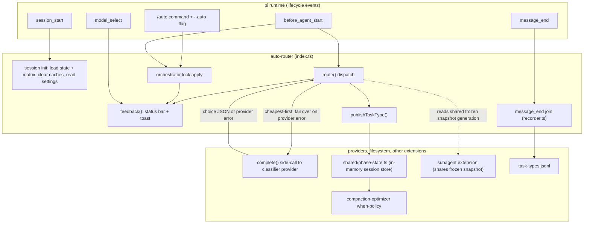
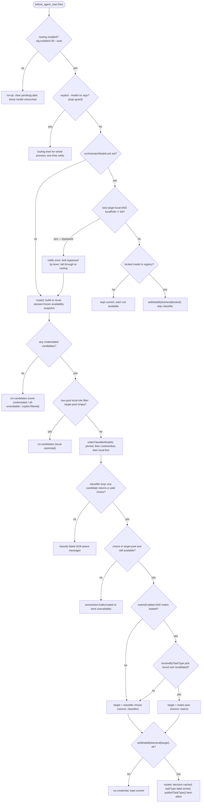
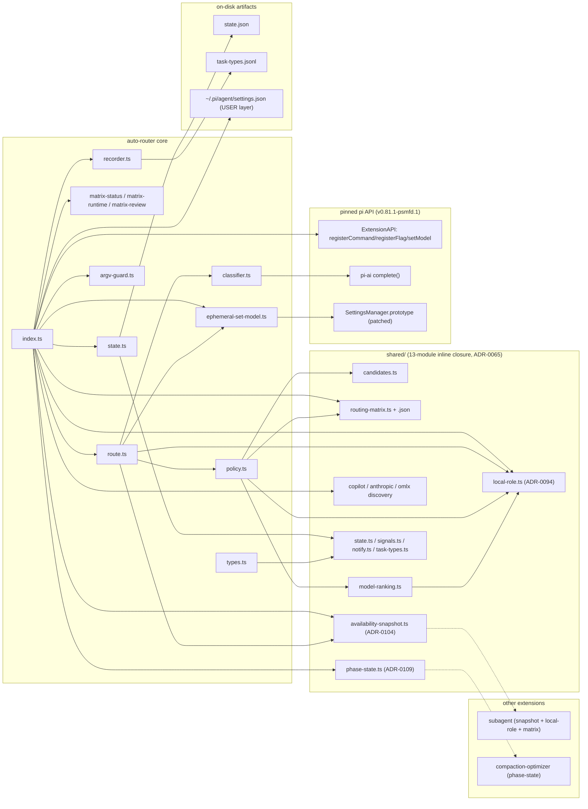

# auto-router

Per-prompt model selection for pi. When enabled, a cheap **classifier** model
picks the best credentialed model for each user prompt and applies it with
`pi.setModel()` before the first provider request. Part of the Pi Extension
Suite (#327); consumes the [`shared/`](https://github.com/psmfd/pi-config/blob/main/agent/extensions/shared/README.md) foundation. See
[ADR-0031](https://github.com/psmfd/pi-config/blob/main/adrs/0031-auto-router.md).

## Install

```sh
pi install git:github.com/psmfd/pi-auto-router
```

Try it first without installing: `pi -e git:github.com/psmfd/pi-auto-router`.

## Flow

1. `before_agent_start` fires once per prompt. If routing is off, no-op (manual `/model` is untouched). If the process was launched with an explicit `--model`, routing is **inert for the whole session** (see [Explicit `--model` precedence](#explicit---model-precedence-519-adr-0076)).
2. `shared/availability-snapshot.ts` reads the **credentialed** registry once, composes Copilot/Anthropic/oMLX live evidence over that exact observation, canonically sorts and hashes it, and freezes the generation for the session (ADR-0104). `policy.ts` builds the parent menu from those candidates with cost/window hints and current context pressure. A primary-provider restriction narrows only the parent menu; subagent policy consumes the same base snapshot with its own local-eligibility rules.
3. `classifier.ts` calls a cheap model via pi-ai **`complete()`** (credentials resolved through `ctx.modelRegistry.getApiKeyAndHeaders()`), instructing it to return only `{"taskType":"<type>","model":"provider/id","reason":"…"}`. The task-type label is **measurement-only** (see [Task-type measurement](#task-type-measurement-351)); an invented or missing label degrades to `unknown` and never fails the parse.
4. When **matrix routing** is enabled (the default since #353/ADR-0079; `/auto matrix off` opts out), the classifier's task-type label consults the hand-authored capability floor and the cheapest capable available model deterministically overrides the classifier's model choice (see [Matrix routing](#matrix-routing-352-adr-0078)); a matrix miss leaves the classifier's pick standing.
5. The choice is resolved against the credentialed menu and applied via `pi.setModel(model)` — **ephemerally**: the runtime's `setModel` also persists its argument to `~/.pi/agent/settings.json` as the global default, so routed picks (and orchestrator-lock application) go through `ephemeral-set-model.ts`, which suppresses that persistence for the duration of the call only (#533, ADR-0096). Manual `/model` picks persist exactly as before. Retires when upstream ships a persist opt-out (earendil-works/pi#5263).
6. A per-session **decision cache** (keyed on a prompt hash) skips re-classifying identical prompts.

**Routing never blocks a turn.** Any failure — no candidates, no credential, parse error, network error, abort, `setModel` returning `false`, or a hallucinated model not in the menu — falls back to the current model.



### Feedback

- **Status bar** (persistent): `🤖 provider/id` shows the model currently in use, refreshed after every routing attempt and on every model change (router `set`, manual `/model`, `Ctrl+P` cycle, session restore), seeded at `session_start`.
- **Toast** (transient): **every** routing outcome speaks, so a session is never silent — `auto-router: routed → provider/id — <reason>` on success, or an explicit cause on a fallback (`classifier returned no choice`, `no credentialed candidates`, `choice "…" unavailable`, `no credential for …`, all `; kept current`).

### Resilience (classifier failover)

The classifier call can fail — most commonly a **429 quota/rate error** from the provider. The router treats any provider error as "this model is unavailable", **fails over to the next candidate** (cheapest-first) until one returns a choice or the list is exhausted, and records the dead `provider/id` in the **shared session-unavailable set** (`shared/session-unavailable.ts`, ADR-0122). That set is excluded from classifier rotation, the parent routing menu, and subagent matrix policy. It is **cleared at `session_start`** so recovered quota gets a fresh chance.

When the cause is specifically a **429 / quota / rate-limit**, the message says so plainly instead of a generic "no choice": `all N candidate model(s) are rate-limited / quota-exhausted (429). Routing paused — use /model to pick a model, or wait for the quota to reset.` Once models are marked unavailable, subsequent prompts hit `no-candidates` (`all-unavailable`) and skip classifier calls entirely — no further quota burn. A normal parent turn is still not replayed after a provider error. An unpinned policy-selected **subagent** has a narrower ADR-0122 exception: it may retry once on the next eligible matrix model only when its structured 429 arrives before any tool-execution event. Explicit pins, session-default children, and post-tool failures never replay.

## Routing decision flow

The complete `before_agent_start` ladder — gates, lock precedence, fallbacks,
and the matrix override:



## Task-type measurement (#351)

Phase 1 of #350 — **measurement only, zero routing-behavior change**. The
classifier labels each prompt with one of a closed taxonomy (`simple-qa`,
`code-edit`, `code-review`, `long-context`, `agentic-loop`, `creative`; anything
else degrades to `unknown`), in the same single call that picks the model. On a
routed turn the label is held **sticky**: every assistant `message_end` until
the next routing attempt is joined with its real token usage and appended as
one JSONL line to `~/.pi/agent/extensions/auto-router/task-types.jsonl` — an
agentic turn produces many assistant messages, and labeling only the first
would understate agentic-loop cost. A non-routed turn (routing toggled off, a
fallback outcome, or a route error) clears the label, so unrouted usage is
never misattributed:

```jsonc
{ "ts":"2026-07-05T14:32:01Z","turn":5,"taskType":"code-edit","source":"classifier",
  "model":"claude-sonnet-5","provider":"anthropic","input":812,"cacheRead":4200,"cacheWrite":0,
  "output":340,"costTotal":0.0193,"policy":"mixed-local" }
```

The decision cache stores the label alongside the target, so cache-hit turns
still record their task type. Recording is observational (never blocks or
rewrites a turn, no message content logged — same posture as token-meter,
ADR-0073). Analyze with:

```sh
scripts/analyze-routing-matrix.sh              # default log location
scripts/analyze-routing-matrix.sh --log <f>    # explicit log(s)
```

which reports per `taskType × model × source` turn counts and average
input/output/cost (cost averages `n/a` when the provider reported none — never
a fabricated $0). Matrix-forced rows render with a `[matrix]` tag; records
written before #352 lack the `source` field and default to `classifier`. This
observed data seeded the Phase 2 routing matrix, and the `source` split is what
keeps it honestly re-evaluable now that #352 consults it (a dataset that can't
separate matrix-forced from organic choices would be self-confirming).

### Cross-extension phase signal (ADR-0109, #677)

On every **routed** outcome, index.ts publishes the task-type label into
`shared/phase-state.ts` (`publishTaskType(sessionId, taskType)`) — an
in-memory, session-keyed store the compaction-optimizer when-policy reads to
detect task-type boundaries (a fresh boundary is a preferred compaction
point). The publish is best-effort and wrapped in try/catch: it never blocks
or disturbs routing, and a missing session id simply skips the signal.

### Local workhorse in the rotation (#363, ADR-0084)

A registered **cost-0 local model** (`omlx/coding-workhorse`, #518) sorts first
in `orderClassifierModels()`, so the local model runs the classifier by default
when available. This is deliberate — the decision is recorded in
[ADR-0076](https://github.com/psmfd/pi-config/blob/main/adrs/0076-model-tier-policy-and-precedence-guard.md):
the call is free and burns no frontier quota, each *novel* prompt costs one of
oMLX's 8 sustained concurrency slots (local-llm ADR-010) and the decision cache
absorbs repeats, and a nominal fake cost would corrupt the #351/#520
observed-cost data.

As of [ADR-0084](https://github.com/psmfd/pi-config/blob/main/adrs/0084-auto-router-prefer-local-classifier.md)
(#589), the local-first preference is enforced explicitly by a strict
`provider === "omlx"` partition placed after the cost/window sort — a live
local candidate leads the classifier rotation even when a cost-0 Copilot model
has a smaller window. "Live" is determined by `shared/omlx-discovery.ts`, whose
probe target is selected from explicit override / `OMLX_BASE_URL` / configured
provider `baseUrl` / localhost default and then loopback-validated. The previous
accepted-tiebreak behavior (smallest window first among cost-0 candidates) is
preserved behind an opt-out.

Operators can override this per-user via `~/.pi/agent/settings.json`
(user-layer only, same trust boundary as `subagent.copilotFallbackModel` per
ADR-0080; project-layer `.pi/settings.json` is deliberately not consulted):

```json
{
  "extensionSettings": {
    "autoRouter": {
      "preferLocalOmlx": false
    }
  }
}
```

Default is `true`. Set `false` to restore pure cost/window ordering. Malformed
or missing values default to `true`. The value is read once on `session_start`.

### Local-LLM role lever (ADR-0094, #685)

`extensionSettings.localLlm.role` (same user-layer-only file; parsed by
`shared/local-role.ts`, consumed by auto-router AND the subagent extension)
globally governs where local (`omlx/*`) models may be used:

```json
{ "extensionSettings": { "localLlm": { "role": "classifier-only" } } }
```

- `"full"` (default) — local participates everywhere current policy allows.
- `"classifier-only"` — local may RUN the classifier side-call, but is
  excluded from the routing menu, matrix picks, and every subagent child.
- `"off"` — no local model anywhere, classifier included.

Under a restricted role, `/auto lock` refuses to lock a local model and a
manual `/model omlx/…` is honored for the live session but not captured into
the persisted lock. Only the three exact strings are recognized; anything
else falls back to `"full"`. Read once on `session_start` (auto-router) and
per tool call (subagent) — children read the same user-layer file, so the
lever applies inside spawned subagents automatically. Per-agent local
permission is the wrapper's `local-llm: true` frontmatter tag (see the
subagent README § patch #12).

An explicit `classifierModel` pin
(`"provider/id"`) in `~/.pi/agent/extensions/auto-router/state.json` still
wins over both this preference and the cost/window sort.

The hand-authored **capability floor** for task-type routing lives in
[`shared/routing-matrix.json`](https://github.com/psmfd/pi-config/blob/main/agent/extensions/shared/routing-matrix.json) — the workhorse's
seed row admits `simple-qa · code-edit · code-review · agentic-loop` and gates
`long-context`/`creative` to the frontier (concurrency is
prefill-activation-bound; quality-tier work is deliberately not local,
ADR-009/010). Consulted by [Matrix routing](#matrix-routing-352-adr-0078)
since #352.

## Matrix routing (#352, ADR-0078)

Phase 2 of #350 — feature-flagged, **on by default since #353 (ADR-0079)**
after the recorded burn-in (97.8% cost reduction, zero quality regressions;
see the #353 evidence comment). When enabled, the
classifier's task-type label consults the capability floor and
`resolveByTaskType` (`policy.ts`) deterministically overrides the classifier's
model choice with the **local-first cheapest capable available window-adequate** candidate:

1. **Capability floor** — matrix membership only, never cost. Closed world for
   picks: a model absent from `routing-matrix.json` is never a *matrix* pick
   (the classifier may still choose it, so absence never removes a model from
   routing — the floor can only decline to override).
2. **Availability** — the pick draws from the same session-frozen canonical
   snapshot the classifier saw (allowlist + Copilot/Anthropic/oMLX filters
   compose once for parent and subagent) and re-checks the session `unavailable` set *after* the classify
   loop, which can 429 a model mid-loop.
3. **Window adequacy** — a candidate already past `FORCE_COMPACT_AT` (90%,
   `shared/signals.ts`) on its *own* window at the current token count is
   excluded before cost-ranking (routing to it would force immediate
   compaction). Unknown usage fails open — the filter is skipped, never
   guessed.
4. **Local-first rank** — when local use is allowed, strict local provider
   matches (`provider === "omlx"` today) form the first lane. Non-local models
   cannot beat a capable local candidate merely by being cheaper or having a
   smaller context window.
5. **Cost-rank within lane** — `input + k·output` with **k = 1** (per-Mtok
   prices; see ADR-0078 Q3 — recalibration from observed token ratios is #541).
   Deterministic tiebreak: smaller window, then `provider/id` order. This is
   deliberately NOT `orderClassifierModels`' input-only sort, which prices the
   classifier side-call, not the real turn.

Any empty stage → typed `null` → the classifier's pick stands (`source:
"classifier"`); a matrix pick that survives every gate routes with `source:
"matrix"` — the toast shows `routed → provider/id [matrix]`, and the source is
recorded on the cached decision and every task-type record. The matrix file is
loaded strictly once per session (`shared/routing-matrix.ts`): typed failures
surface to the operator while routing still degrades fail-soft to classifier
picks. Toggling `/auto matrix on|off` clears the decision cache. `validate.sh`
guards the committed matrix structure and freshness. Routing never silently
refreshes or rewrites policy while classifying a prompt.

### Explicit matrix status, review, and refresh (#749/#750)

The versioned policy/status/review contract is
[`MATRIX_LIFECYCLE_V1.md`](./MATRIX_LIFECYCLE_V1.md). It is the maintained field,
state, hash/generation, side-effect, and standalone-path reference.

```text
/auto matrix status
/auto matrix status --json
/auto matrix refresh
/auto matrix refresh --retry-unavailable
/auto matrix review
/auto matrix review --json
```

`status` builds or reuses the canonical availability snapshot and reports the
matrix load state, diagnostics, generation/hash, static/live model counts,
provider filter states, freshness source/threshold, actionable
intersection/unlisted/inert/dangling/filtered coverage, effective
local-role/allowlist inputs, session-unavailable models, and registry-reload
guidance. Snapshot failures use a fixed typed code rather than raw provider
errors. `--json` emits the stable v1 payload for audit or tooling.

`refresh` is memory-only and explicit: it reloads the committed matrix, clears
all three provider-discovery caches plus the shared snapshot and decision
cache, then builds one new frozen generation. The clear aborts the prior
snapshot generation, and cache epochs prevent an older in-flight provider
request from repopulating evidence afterward. Building the replacement performs
provider discovery and may resolve operator-configured credentials (including a
`models.json` `!command` resolver), just like the first status build. It
**preserves** the session 429/provider-error deny set by default;
`--retry-unavailable` explicitly clears that set before rebuilding. Neither
form writes capability policy.

`review` is observational and uses only an existing frozen snapshot; it does
not initiate discovery, credential resolution, or refresh evidence. If no
snapshot exists, the report says evidence is not built and proposes an explicit
refresh. It emits stable facts, observations, and human-action proposals plus a
canonical evidence hash. The hash identifies normalized policy, snapshot hash,
typed diagnostics, and transient unavailable inputs; it is not a signature of
the rendered bytes or their generation/time display fields. Proposals identify
additions, changes, or removals that a person should investigate and list the
evidence required; they never infer or grant capabilities, select a tier, emit
a patch, or write policy. `--json` emits the v1 review schema; identical frozen
inputs produce byte-identical output, while a replacement generation changes
its generation/time display metadata.
Detail arrays are capped at 100 entries with explicit omitted counts, and
retained rationale display is capped at 500 characters; full inputs still
participate in the evidence hashes.

Pi v0.81.1-psmfd.1 exposes no documented extension API that reloads only the static
model registry. If `~/.pi/agent/models.json` changed, open `/model` first (Pi
reloads that file when the picker opens), then run `/auto matrix refresh`.

#### Review terminology

| Term | Meaning |
|---|---|
| Fact | Host/session-scoped registry, snapshot, and reviewed-policy evidence. It is not a universal capability claim. |
| Observation | A deterministic classification such as live-unlisted, filtered-unlisted, inert, dangling, filtered, transiently unavailable, stale, or rationale/context conflict. |
| Inert row | A reviewed row whose provider is absent from this host registry. It cannot participate here, but may be an intentional forward declaration. |
| Proposal | A human-action item with required evidence. It changes nothing and grants no capability. |

#### Standalone mirror review and source control

The standalone `pi-auto-router` mirror ships this command and its inlined
`shared/routing-matrix.json`; it does **not** depend on monorepo-only scripts or
`jq`:

1. If registry configuration changed, open `/model`, then explicitly run
   `/auto matrix refresh`.
2. Run `/auto matrix review` for a readable report or
   `/auto matrix review --json` for an auditable artifact. Retain the evidence
   hash with the review.
3. Investigate each proposal using provider identity, capability, quality, and
   rationale evidence. Availability, context size, and cost alone never prove
   capability.
4. Submit the evidence through source control. In this repository the canonical
   path is `agent/extensions/shared/routing-matrix.json`; in the standalone
   distribution it is `shared/routing-matrix.json`. The standalone file is a
   synchronized distribution copy, so prefer an upstream issue/PR for durable
   policy changes.
5. A human edits the matrix and lands it through a reviewed PR. Run the package
   tests before merge. No review or refresh command applies the change.

## Routing controls and precedence

Session-level controls that govern the parent `pi.setModel()` path regardless
of whether matrix routing is enabled (they were historically documented under
Matrix routing; none is matrix-specific):

### Primary/orchestrator provider restriction (#552, ADR-0083)

Operators who want the parent/orchestrator session to stay on a provider tier
(for example Copilot) can restrict auto-router's **primary** candidate menu
without changing subagent behavior:

```text
/auto primary copilot
/auto primary providers set github-copilot anthropic
/auto primary clear
/auto primary status
```

`/auto primary copilot` is shorthand for `primary providers set
github-copilot`. When the restriction is non-empty, the classifier and matrix
routing only see candidates from those providers for the parent session. A
local-only matrix row such as `omlx/coding-workhorse` therefore cannot override
a primary Copilot restriction; if no allowed provider is credentialed, the
router keeps the current model and reports that the restriction left no
candidates instead of falling through to local.

This split is intentionally scoped to auto-router's parent-session
`pi.setModel()` path. Subagent children independently consume the same frozen
availability snapshot and capability matrix. Thirteen first-party wrappers
request local eligibility with `local-llm: true`; `code-review-expert` and
`security-review-expert` request `capability-tier: frontier` (`linter`
carries no tier); and local-forbidden wrappers (including `bash`
tool surfaces) remove local candidates before matrix selection. No first-party
wrapper currently carries an exact `model:` pin. Explicit third-party pins
remain authoritative and still pass through the spawn-time liveness/fallback
gate. A local-forbidden child with no non-local matrix pick fails closed rather
than inheriting the parent primary or a possibly-local session default. If a
policy-selected child later reports a structured 429 before any tool event,
ADR-0122 adds that exact model to the shared session deny set and permits one
reselection against the same snapshot/matrix generation. Result telemetry names
the failed and effective fallback models; any tool edge refuses replay.

### Lock the orchestrator model while auto-router is active (ADR-0090)

To keep the parent/orchestrator on one exact model while `/auto on` remains
active, use the orchestrator model lock:

```text
/auto lock current                     # lock to the model currently shown by pi
/auto lock set github-copilot/gpt-5-mini
/auto lock clear
/auto lock status
```

`/auto on` seeds the lock from the current model when no lock exists, so turning
routing on no longer implies per-prompt parent-model drift. While the lock is
set, `before_agent_start` re-applies the exact `provider/id` if needed and
skips the classifier/matrix side-call for the parent turn. If the locked model
is no longer registry-available or lacks credentials, the router reports the
problem and keeps the current model rather than silently switching.

Manual model changes while auto-router is active update the lock to the newly
selected exact model (unless the process itself was launched with explicit
`--model`, in which case the argv precedence guard makes routing inert). This
lock is distinct from the provider-level `/auto primary providers ...`
restriction below: provider restriction narrows a routing menu; model lock fixes
the parent model.

### Explicit `--model` precedence (#519, ADR-0076)

An explicit `--model` on the command line **wins unconditionally**: routing is
inert for the entire process, even when `/auto on` is persisted or `--auto` is
also passed. The check (`argv-guard.ts`) short-circuits `before_agent_start`
*before* the classifier side-call and the Copilot/oMLX discovery probes, so a
pinned invocation pays none of the routing cost — this is what keeps the
subagent extension's frontmatter pins authoritative inside spawned children,
where the router's disk-global enable state would otherwise re-route over the
pin (and, via pi's `setModel`, rewrite the operator's saved default — #533).
Detection mirrors pi's parser exactly (two-token `--model <value>`; `--models`
never matches; a trailing valueless `--model` is ignored). One toast on the
first gated turn; `/auto status` reports `ON (inert: explicit --model)`.
Accepted gap: the guard is argv-anchored, so resumed sessions and mid-session
`/model` picks are not covered (pi persists no model-provenance) — see
ADR-0076.

## Controls

| Control | Effect |
|---|---|
| `/auto` | Toggle routing ON/OFF; persisted across sessions (`shared/state.ts`, namespace `auto-router`). |
| `/auto on` / `/auto off` | Explicit ON/OFF aliases for the same persisted routing toggle. |
| `/auto status` | Show ON/OFF + the configured classifier model + matrix on/off + `preferLocalOmlx` + `localLlm.role` + orchestrator model lock + primary provider restriction; appends `(inert: explicit --model)` when the precedence guard is active. |
| `/auto settings` | Interactive settings menu (non-freeform selections): routing toggle, matrix toggle, primary-provider selection checklist, lock-to-current/clear lock, and user-layer oMLX settings (`preferLocalOmlx`, `localLlm.role`). |
| `/auto settings status` | Show the same consolidated status payload as `/auto status`. |
| `/auto matrix on` / `/auto matrix off` | Toggle the deterministic capability-matrix override (#352); persisted; clears the decision cache. |
| `/auto matrix status [--json]` | Report typed matrix state, canonical snapshot generation/hash, provider evidence, coverage counts/rows, and effective policy inputs; JSON is stable schema v1. |
| `/auto matrix refresh [--retry-unavailable]` | Explicitly reload matrix memory and provider/snapshot/decision caches without writing policy; preserves session-unavailable by default, clears it only with the retry flag. Open `/model` first after editing `models.json`. |
| `/auto matrix review [--json]` | Emit a deterministic review report with canonical evidence hash, facts, observations, and human-action proposals. Uses the frozen snapshot; has no apply/write mode. |
| `/auto lock status` / `/auto lock current` / `/auto lock set <provider/id>` / `/auto lock clear` | Inspect, set, or clear the exact parent/orchestrator model lock used while auto-router is active. |
| `/auto primary copilot` | Restrict parent/orchestrator routing candidates to `github-copilot/*`; subagent matrix policy is unchanged. |
| `/auto primary providers set <provider> [...]` | Restrict parent/orchestrator routing to the listed providers. |
| `/auto primary providers add <provider> [...]` / `/auto primary providers remove <provider> [...]` | Edit the parent/orchestrator provider restriction. |
| `/auto primary status` / `/auto primary providers status` | Inspect the parent/orchestrator provider restriction. |
| `/auto primary clear` / `/auto primary providers clear` | Clear the parent/orchestrator provider restriction and restore the unrestricted candidate menu. |
| `/auto orchestrator ...` | Exact alias for the `/auto primary ...` command family. |
| `--auto` | Enable routing for the current session (in addition to the persisted toggle). |

## State

`~/.pi/agent/extensions/auto-router/state.json`, schema-versioned (`{v:1}`):
`{ enabled, classifierModel, orchestratorModelLock, allowlist,
orchestratorAllowedProviders, matrixEnabled }`. `classifierModel` null ⇒ the
cheapest credentialed candidate runs the classifier. `orchestratorModelLock`
null ⇒ no exact parent lock; otherwise the parent session is held to that exact
`provider/id` while routing is active. `allowlist` (empty ⇒ all) limits routing
targets to specific `provider/id` entries. `orchestratorAllowedProviders`
(empty ⇒ all) limits only the parent/orchestrator provider menu; it does not
modify subagent child policy or explicit third-party pins. `matrixEnabled`
(default true since #353/ADR-0079)
gates matrix routing. `load()` merges the persisted file over the defaults, so
a state file lacking a newer field gets the current default, while an explicitly
persisted `false` (a real `/auto matrix off`) always survives.

## Files

| File | Role |
|---|---|
| `MATRIX_LIFECYCLE_V1.md` | Maintained policy/status/review schema, generation/hash, command side-effect, standalone-path, and validation contract. |
| `index.ts` | Factory: wires `before_agent_start`, `/auto`, `--auto`, the `🤖 provider/id` status-bar segment (`ctx.ui.setStatus` on `model_select` + `session_start`), `session_start` state restore, and the `message_end` task-type recorder join. |
| `argv-guard.ts` | `hasExplicitModelFlag()` — the explicit `--model` precedence check (#519, ADR-0076). |
| `policy.ts` | Candidate menu + classifier prompt; resolve/validate the choice; pick the classifier model; `resolveByTaskType` — the deterministic matrix pick (#352). |
| `classifier.ts` | The `complete()` side-call + JSON parse; graceful `null` on any failure. |
| `route.ts` | Dispatch logic (structurally typed, unit-tested); returns a `RouteOutcome`. |
| `matrix-status.ts` | Stable v1 matrix/snapshot/coverage status payload plus human and JSON formatters. |
| `matrix-runtime.ts` | Explicit refresh orchestration: clear memory caches, optionally retry session-unavailable models, reload policy, and build a new generation. |
| `matrix-review.ts` | Pure deterministic facts/observations/proposals report with canonical evidence hashing and human/JSON formatters; no filesystem or policy-write access. |
| `ephemeral-set-model.ts` | `setModelEphemeral()` (#533, ADR-0096): monkey-patches `SettingsManager.prototype.setDefaultModelAndProvider` to a no-op for the duration of each routed/lock `pi.setModel()` call, so routing never rewrites the persisted global default. **Fail-open** on upstream shape drift (falls back to plain `setModel`, which persists); a microtask-scale race window where a concurrent manual persist would be suppressed is accepted and documented in the module. Retires when upstream ships a persist opt-out (earendil-works/pi#5263). |
| `../shared/copilot-discovery.ts` | Live GitHub Copilot `/models` discovery — filters the menu to genuinely-usable copilot models (ADR-0035). In `shared/` since #536 (the subagent spawn gate reuses it); auto-router remains the session_start cache-clearer alongside subagent's own. |
| `../shared/availability-snapshot.ts` | ADR-0104 canonical, immutable registry + Copilot/Anthropic/oMLX evidence shared with subagent policy; stable hash and process-local generation. |
| `../shared/anthropic-discovery.ts` | Live Anthropic `/v1/models` discovery — drops retired registry ids that 404 when routed (#538); moved to shared for parent/child parity. |
| `../shared/omlx-discovery.ts` | Live oMLX `/v1/models` probe — drops the local candidate when the server is confirmed down or the model unloaded (#364). In `shared/` since #534 (the subagent spawn gate reuses it for liveness gating, ADR-0081); auto-router still clears its cache on `session_start`. |
| `recorder.ts` | #351 measurement pipeline: join a routed turn's task-type label with its real usage → `task-types.jsonl`. |
| `state.ts` | Persisted toggle/config (incl. `matrixEnabled`) + in-memory decision cache (`{target, taskType, source}` per prompt hash). |
| `types.ts` | `RouterModel` (= `complete()`'s model param), `Auth`, `PickSource`, and the `TASK_TYPES` alias sourced from `shared/task-types.ts`. |

### Shared foundation

The table above details the four discovery/snapshot modules; auto-router's
full direct `../shared/` import surface is **13 modules** — `candidates`,
`signals`, `notify`, `state`, `routing-matrix` (+ `routing-matrix.json`),
`task-types`, `model-ranking`, `availability-snapshot`, `copilot-discovery`,
`anthropic-discovery`, `omlx-discovery`, `local-role`, and `phase-state` —
matching the standalone mirror's inline closure in `mirror/targets.yml`
(ADR-0065; `cost.ts` rides along transitively via `candidates`). Per-module
purpose and contracts live in [shared/README.md](https://github.com/psmfd/pi-config/blob/main/agent/extensions/shared/README.md).



## Canonical availability snapshot (ADR-0104)

The three live-availability layers below do not act independently: while
building the session's canonical snapshot, `shared/availability-snapshot.ts`
reads the credentialed registry **once**, composes the Copilot, Anthropic, and
oMLX evidence over that exact observation, canonically sorts and SHA-256
hashes the result, and freezes the generation for the session. Both
auto-router's parent-session routing and subagent policy consume the same
frozen generation, so a mid-session availability flap cannot desynchronize
them; `/auto matrix refresh` is the explicit rebuild lever.

### Copilot live availability (ADR-0035, #343)

pi's `getAvailable()` reflects a **static** catalog filtered by credential, so it over-reports `github-copilot` models the subscription cannot serve (tier-gated or picker-disabled) — which then 400 when routed (e.g. `github-copilot/gpt-5.4-nano`). While building the canonical snapshot, `shared/copilot-discovery.ts` (relocated in #536) queries the live Copilot `/models` endpoint (auth + base both derived from the JWT pi already manages via `getApiKeyAndHeaders`) and keeps only `model_picker_enabled === true && policy.state !== "disabled"` models; copilot candidates absent from that set are dropped. Non-copilot providers are untouched.

**Fail-open:** any failure — no JWT, network error, non-2xx, malformed/empty body, or the five-second discovery deadline — leaves the static menu unchanged (routing never breaks). Discovery caches model ids for 20 minutes only, never the JWT; cache epochs reject stale in-flight writes after a clear. ADR-0104 then freezes the evidence in the shared session snapshot until session start or an explicit refresh clears it. When the live filter legitimately empties an all-Copilot menu, the `copilot-filtered` outcome explains it ("gated by your subscription tier — use /model") instead of the misleading "no credentialed models."

### Anthropic live availability (#538)

The third instance of the live-discovery pattern: pi's static registry keeps
**retired** Anthropic ids (e.g. `claude-3-haiku-20240307`), and with auth
configured they enter `getAvailable()` — the classifier then routes real turns
to models the API 404s (observed live: every simple-qa prompt on an
Anthropic-credentialed host picked the retired cheapest entry and failed).
Before building the canonical snapshot, `shared/anthropic-discovery.ts` queries the live
`GET /v1/models` endpoint (paginated; auth reuses whatever pi manages via
`getApiKeyAndHeaders` — `x-api-key` for API keys, `Bearer` + oauth beta header
for `sk-ant-oat…` tokens) and drops anthropic candidates absent from the
result. Non-anthropic providers are untouched.

**Fail-open (Copilot semantics, not the oMLX authoritative-empty):** any
failure — no credential, an auth grant `/v1/models` rejects, non-2xx,
malformed/oversized/empty body, network error, or the five-second discovery
deadline — leaves the static menu unchanged. Discovery caches model-id strings
for 20 minutes only, never the credential; cache epochs reject stale in-flight
writes after a clear. ADR-0104 freezes that evidence in the shared session snapshot.
Host-pinned to `api.anthropic.com`, HTTPS-only, no off-host redirect.

### oMLX live availability (#364)

The local-server analog of the Copilot filter: pi treats the registered omlx
model (#518) as available whenever its `!cat` apiKey is *configured* — the
command is never executed by the availability check — so a stopped server or
an unloaded model still looks routable. While building the canonical snapshot,
`shared/omlx-discovery.ts` (relocated in #534) probes `GET /v1/models` on the loopback base
(`OMLX_BASE_URL` override honored, non-loopback refused; bearer read at
request time from `OMLX_API_KEY` or `~/.omlx/api-key`, never stored or
logged; 60s TTL cache of model-id strings only). ADR-0104 freezes the
resulting evidence in the shared session snapshot.

Filtering happens **only on confirmed evidence**: a connection-level failure
(server down — the one case where, unlike the Copilot filter, an *empty* set
is authoritative and drops every omlx candidate) or a 200 response missing
the model's alias (not loaded). Everything ambiguous fails open — timeouts
(a saturated oMLX mid-prefill answers `/v1/models` slowly while being very
much alive), 401/5xx (the probe's key handling must never kill a candidate
pi's own request-time resolution might serve), malformed bodies. Non-omlx
candidates are never touched, and all filters (allowlist, Copilot, Anthropic,
oMLX) compose AND-wise in ADR-0104's session-frozen snapshot.

## Deferred (post-v1)

- **Mid-loop escalation** (`turn_start` + `setModel`) — re-routing within a turn loop.
- **Indexing-bias policy** — lower the capability bar for prompts answerable via `search_codebase` retrieval (needs Workstream C / indexing live).

## Cost

One extra cheap-model round-trip per *novel* prompt (cached prompts cost nothing). Mitigated by a tight prompt, the cheap classifier model, and the decision cache.

## API provenance

Verified against **pi v0.81.1-psmfd.1** — the installed `agent/vendor/pi` pin (originally validated against pi v0.79.0 in Phase 0 #328, re-verified at v0.80.2 in #573, v0.80.10 in #791, and v0.81.1 during the 2026-07-23 Copilot matrix refresh): event lifecycle (`before_agent_start` → … → `before_provider_request`), `pi.setModel`/`registerCommand`/`registerFlag`, `ctx.modelRegistry.{getAvailable,getApiKeyAndHeaders,find}`, `model_select`, and pi-ai `complete()` (`examples/extensions/qna.ts`, `summarize.ts`, `handoff.ts`, `custom-compaction.ts`).

> **Note on pi-ai imports.** pi 0.80.x moved the request/response API (`complete`, `completeSimple`, `stream`, `getModel`, `getModels`, `getProviders`, `registerApiProvider`, `getEnvApiKey`, …) off the `@earendil-works/pi-ai` root entrypoint to `@earendil-works/pi-ai/compat`. Runtime is unaffected (the extension loader aliases root → compat as a strict superset), but source that typechecks against the published `.d.ts` must import from `/compat`. The compat entrypoint is officially supported; upstream has stated it will be removed in a future release with a migration guide — tracked as #577.

## Tests

```sh
./scripts/test-auto-router.sh          # node:test via tsx
VERBOSE=1 ./scripts/test-auto-router.sh
```

Unit tests use mocked `pi`/`ctx` and an injected `complete` so the parse/policy/fallback/cache logic runs offline. Live routing-quality validation is recorded in PR #342 via a probe run in a real pi session.
